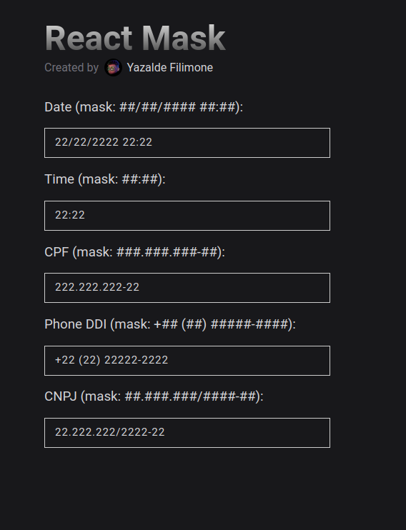

 <p align="center">
  
  
  
  
  
</p>
<p align="center" >
Tiny input mask library for React.js (directive)
<P/>

## Quick Start

1. Initialization

```bash
npm install react-mask
# or
yarn add react-mask
```

2. Usage

```ts
import { InputMask } from 'react-mask';

export const MyComponent = () => {
  return (
    <div>
      <InputMask type="number" mask="##/##/#### ##:##" placeholder="Write here..." />
    </div>
  );
};
```

_Notice:_ returns a pure HTML input, you could put css or do what you would do with a normal input tag

## Exemple



## License

[MIT](https://github.com/yazaldefilimonepinto/react-mask/blob/main/LICENSE) © [Yazalde Filimone](https://www.linkedin.com/in/yazalde-filimone/)
